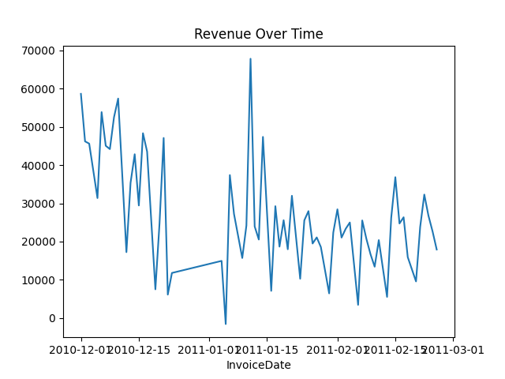
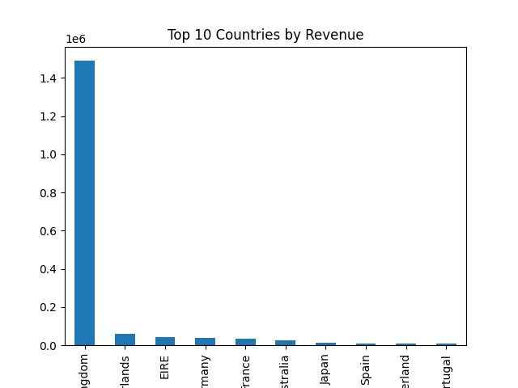

# 📊 E-commerce Customer & Revenue Analysis

🚀 Turning raw transaction data into meaningful business insights using Python and Pandas.

💡 A small percentage of customers contributes a large portion of total revenue (Pareto principle).

---

## 📌 Overview

This project analyzes an e-commerce dataset to understand customer behavior, revenue trends, and business performance. The goal is to extract actionable insights from real-world data.

---

## 📈 Key Analysis

### 🔹 Revenue Trend



* Analyzed how revenue changes over time
* Identified fluctuations and peak periods

---

### 🔹 Top Countries by Revenue



* Compared revenue contribution across countries
* Identified top-performing regions

---

### 🔹 Customer Insights

* Segmented customers based on total spending
* Identified high-value customers
* Analyzed repeat vs new customers

---

## 🔍 Key Insights

* Top ~20% of customers contribute a large portion of revenue
* Revenue fluctuates over time indicating demand patterns
* Customer behavior varies across countries
* Repeat customers significantly impact revenue

---

## 🛠️ Tech Stack

* Python
* Pandas
* NumPy
* Matplotlib

---

## 📂 Project Structure

```
ecommerce-analysis/
├── data/        # sample dataset
├── notebook/    # analysis notebook
├── images/      # charts
├── README.md
├── requirements.txt
```

---

## ▶️ How to Run

```bash
pip install -r requirements.txt
```

---

## 📁 Dataset

Note: The full dataset is large, so a sample dataset is included for demonstration.

---

⭐ If you like this project, consider giving it a star!
